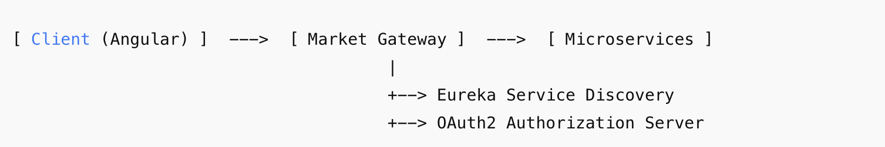

# Market Gateway Router

The Market Gateway Service is an API Gateway based on Spring Cloud Gateway, acting as the single entry point for all microservices in the Market Platform.
It provides intelligent routing, authentication, and cross-cutting concerns such as security, CORS, monitoring, and logging.

This service integrates with Eureka Service Discovery for dynamic routing and supports OAuth2/OpenID Connect (OIDC) for authentication and Single Sign-On (SSO).

## Key Responsibilities
* Centralized Routing: Directs requests from clients to appropriate backend services.

* Service Discovery: Uses Eureka to dynamically resolve service locations.

* Security Layer: Handles authentication and authorization with OAuth2/OIDC.

* CORS Management: Configures cross-origin requests for frontend applications.

* Logout Handling: Supports centralized logout with Identity Provider (e.g., Spring Authorization Server).

* Custom Filters: Adds custom behaviors (logging, tracing, request modification).
## Features
* Dynamic Routing using spring-cloud-starter-gateway

* OAuth2/OIDC authentication for securing endpoints

* Integration with Eureka for automatic route resolution

* Support for Angular/React Frontend with withCredentials

* Custom Gateway Filters for:

    * Logging request details

    * Adding correlation IDs for distributed tracing

* Session Management & Logout with redirects to the Identity Provider

## Architecture

The Market Gateway sits between clients (web/mobile apps) and microservices.
It handles:

* Security (SSO, JWT, Token relay)

* Routing (path-based, service-based)

* Cross-cutting concerns (logging, resilience)



## Security

Market Gateway uses Spring Security with OAuth2 / OIDC:
* Login via /oauth2/authorization/{registrationId}
* Logout via /user/logout with redirection to OP
* Connect user /use/sso
* Session invalidation and clearing SecurityContext

## Building from Source
Market Gateway Router uses a Gradle-based build system. 
In the instructions below, ./gradlew is invoked from the root of the source tree and serves as a cross-platform, self-contained bootstrap mechanism for the build.
### Prerequisites
Git and the JDK21.
### Check out sources
```
$ git clone git@github.com:ZiedEcheikh/market-gateway-router.git
```

### Compile and test
Gradle 9.0.0

```
$ ./gradlew build
```

### Building blocks
| Component                                                | Version |
|:---------------------------------------------------------|:-------:|
| spring-core                                              |  6.2.9  |
| spring-boot                                              |  3.5.4  |
| spring-boot-starter-oauth2-client                        |  3.5.4  |
| spring-boot-starter-webflux                              |  3.5.4  |
| spring-cloud-starter-gateway                             |  4.3.0  |
| spring-cloud-starter-netflix-eureka-client               |  4.3.0  |
### Run
```
$  ./gradlew bootRun --args='--spring.profiles.active=local'
```
To active profile for run in the IntelliJ IDEA, add to VM options : -Dspring.profiles.active=local
